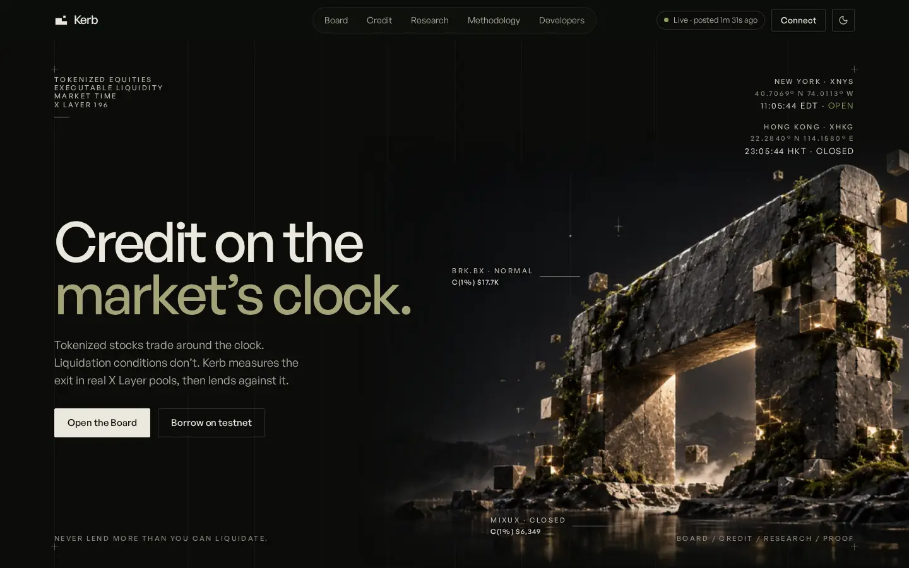

# Kerb

[](https://github.com/Franlinozz/Kerb/actions/workflows/ci.yml)

**Credit on the market's clock.** Tokenized stocks trade on X Layer around the clock; the markets
behind them do not. Kerb measures the exit that is really there, hour by hour, and turns it into
credit terms posted on X Layer mainnet.

[](https://www.usekerb.xyz)

**Live:** [www.usekerb.xyz](https://www.usekerb.xyz) · API [api.usekerb.xyz](https://api.usekerb.xyz/health)
· **Demo video:** linked here on submission day (25 Sep 2026) · Built for OKX Dev Day 2026, Build a Market.

## How it works

1. **Clock.** Each asset follows its underlying market's calendar (NYSE, Nasdaq, NYSE Arca, HKEX with its lunch break), resolved the same way on chain (`KerbClock`) and off.
2. **Depth.** Kerb walks the real Uniswap V3 pools on X Layer tick by tick and finds C(1%), the largest sale that moves the price at most 1%, cross-checked against the OKX DEX aggregator; the smaller wins.
3. **Mark.** A conservative Credit Mark: the lower of the reference median and the pool price along the whole path to USDG, less a haircut set by the regime.
4. **Terms.** Carry (sized to survive until the next deep market), Session Max (more now, with a promise to cure) and a debt ceiling capped by measured depth, signed and posted on chain by `KerbTerms` every few minutes.
5. **Credit.** Kerb Credit lends against those terms. At **Last Call**, before the market weakens, a Session Max position must be back at its Carry target; anyone may cure it for a small bonus. The liquidation threshold never moves.

The formula is the open **Kerb Terms Standard**, now **KTS 0.2** ([docs/v2/KTS-0.2.md](docs/v2/KTS-0.2.md)): each mode's margin below the fixed liquidation line is tied to how long it must survive, so before a long closure Carry tightens while Session Max, which only has to reach the next Last Call, does not.

## Try it

1. Open [www.usekerb.xyz/credit](https://www.usekerb.xyz/credit) and connect a browser wallet (OKX Wallet or any EIP-6963 wallet); the page adds X Layer testnet (1952).
2. Get test OKB for gas from the [X Layer faucet](https://www.okx.com/xlayer/faucet).
3. Mint test collateral (kKOx) and mUSDG with the buttons in "Get set up".
4. Deposit, choose **Session Max**, borrow. The demo clock runs a trading week every hour: when its Last Call opens, your position appears in **Curable now**; repay the difference, or cure it from a second wallet.

The credit plane is on testnet with clearly labelled mirror collateral; its risk terms are relayed from mainnet.

## Verify any number

Every Terms post carries the keccak256 of the complete input bundle. Take the `inputsHash` from any `TermsPosted` event (or from [/proof](https://www.usekerb.xyz/proof)):

```
pnpm --filter @kerb/engine kerb verify <inputsHash>
```

It fetches the bytes, checks they hash to what is on chain, recomputes every figure under the formula version the bundle carries, and compares with the posted terms. `/proof` runs the same comparison live on the latest report.

## Deployments

| Contract | Network | Address | Source |
|---|---|---|---|
| KerbClock | X Layer mainnet 196 | [0xf765d374e0ce576860a463f0d796ad45c62161b8](https://www.oklink.com/xlayer/address/0xf765d374e0ce576860a463f0d796ad45c62161b8) | [Sourcify exact match](https://repo.sourcify.dev/contracts/full_match/196/0xf765d374e0ce576860a463f0d796ad45c62161b8/) |
| KerbTerms | X Layer mainnet 196 | [0x6d6eaf24c498df6cef0954f6d19ab4ea7b0102d5](https://www.oklink.com/xlayer/address/0x6d6eaf24c498df6cef0954f6d19ab4ea7b0102d5) | [Sourcify exact match](https://repo.sourcify.dev/contracts/full_match/196/0x6d6eaf24c498df6cef0954f6d19ab4ea7b0102d5/) |
| KerbClock | X Layer testnet 1952 | [0x6c1de992e3219980138d7e51b67ecc523618bc5c](https://www.oklink.com/x-layer-testnet/address/0x6c1de992e3219980138d7e51b67ecc523618bc5c) | [Sourcify exact match](https://repo.sourcify.dev/contracts/full_match/1952/0x6c1de992e3219980138d7e51b67ecc523618bc5c/) |
| KerbTerms | X Layer testnet 1952 | [0x5a4942f55e37994370745ef984a21321edb75f7e](https://www.oklink.com/x-layer-testnet/address/0x5a4942f55e37994370745ef984a21321edb75f7e) | [Sourcify exact match](https://repo.sourcify.dev/contracts/full_match/1952/0x5a4942f55e37994370745ef984a21321edb75f7e/) |
| KerbCredit | X Layer testnet 1952 | [0xa1314645cd6c07e651359aba540e2600090b98a8](https://www.oklink.com/x-layer-testnet/address/0xa1314645cd6c07e651359aba540e2600090b98a8) | [Sourcify exact match](https://repo.sourcify.dev/contracts/full_match/1952/0xa1314645cd6c07e651359aba540e2600090b98a8/) |
| KerbClockDemo | X Layer testnet 1952 | [0xd2483b2d8bd759f87fadb21117498a5db36bcb0f](https://www.oklink.com/x-layer-testnet/address/0xd2483b2d8bd759f87fadb21117498a5db36bcb0f) | [Sourcify exact match](https://repo.sourcify.dev/contracts/full_match/1952/0xd2483b2d8bd759f87fadb21117498a5db36bcb0f/) |
| KerbMirror kKOx | X Layer testnet 1952 | [0x11827f0f59d516e3778951fde36bd0d961af4a16](https://www.oklink.com/x-layer-testnet/address/0x11827f0f59d516e3778951fde36bd0d961af4a16) | [Sourcify exact match](https://repo.sourcify.dev/contracts/full_match/1952/0x11827f0f59d516e3778951fde36bd0d961af4a16/) |
| KerbMirror kHKEXCx | X Layer testnet 1952 | [0x80da4036ee45e6d66a27dba415a4ce23eb9360f2](https://www.oklink.com/x-layer-testnet/address/0x80da4036ee45e6d66a27dba415a4ce23eb9360f2) | [Sourcify exact match](https://repo.sourcify.dev/contracts/full_match/1952/0x80da4036ee45e6d66a27dba415a4ce23eb9360f2/) |
| MockUSDG | X Layer testnet 1952 | [0x91fcf99262214c32f6fe342d94c7b0dfb2dba679](https://www.oklink.com/x-layer-testnet/address/0x91fcf99262214c32f6fe342d94c7b0dfb2dba679) | [Sourcify exact match](https://repo.sourcify.dev/contracts/full_match/1952/0x91fcf99262214c32f6fe342d94c7b0dfb2dba679/) |

Loan asset on mainnet: USDG (`0x4ae46a509F6b1D9056937BA4500cb143933D2dc8`). Builder Code `kt0hl6xyhlx8xmt` rides as an ERC-8021 suffix on every transaction Kerb sends, and `/proof` decodes it from each recent post.

## What we measured

[Market-Time Report #1](https://www.usekerb.xyz/research/1): over 42 hours and 35,130 readings of a closed weekend, in-range liquidity fell on 7 of 10 asset pools, the largest by 49%. A capacity number fixed at Friday's close would have been wrong all weekend. Report #2 measures the end of the X Liquidity incentives on 24 Sep.

## Tests

545 TypeScript and 106 Solidity tests, and 47 end-to-end tests in a real browser, all in CI on every push. The E2E suite runs against a production build and recorded real API responses, and includes axe accessibility checks on every route in both themes. Among the unit tests: a 1,000-timestamp fuzz showing the onchain clock agrees with the TypeScript resolver, byte-identical recomputation of historical bundles, and Kerb Credit invariants under a guided handler. The full credit lifecycle has also been run in real browsers on testnet (evidence in `data/credit-flow-2026-09-22*.json`, shown on `/proof`).

```
pnpm install && pnpm typecheck && pnpm test && pnpm lint
cd contracts && forge test
pnpm --filter @kerb/web e2e          # against a running app (KERB_WEB_URL)
pnpm --filter @kerb/web e2e:live     # against www.usekerb.xyz
```

## Limitations

- The credit plane runs on X Layer testnet with mirror collateral and mUSDG: the builder does not hold or route around restrictions on the production tokenized assets. Its terms are relayed from mainnet.
- The contracts are **unaudited**. The mainnet deployment is the risk plane only and holds no user funds.
- Reference prices come from issuer data with an independent public check; Chainlink Data Streams would be the stronger rung and needs credentials. Bundles are served by the Kerb API where IPFS pinning hit its plan limit. Every rung is stated live on [/proof](https://www.usekerb.xyz/proof) and in [SECURITY.md](SECURITY.md).

## Repository

| Path | What |
|---|---|
| `apps/collector` | Append-only observation loops: pool state, prices, quotes, multipliers |
| `apps/engine` | KTS as pure functions, `kerb report`, `kerb verify`, Market-Time Reports |
| `apps/attester` | Signs, stores and posts terms; deployment scripts |
| `apps/api` | Public read API ([docs/API.md](docs/API.md), every endpoint with a real response) |
| `apps/indexer` | Chain events into Postgres, reorg-aware |
| `apps/web` | The site; `e2e/` is the Playwright suite |
| `packages/v3math`, `packages/calendar` | Exact tick-walk simulation; per-market calendars and the Clock |
| `contracts` | KerbClock, KerbTerms, KerbCredit, KerbMirror, KerbClockDemo |

## Attribution and licences

Kerb is MIT licensed ([LICENSE](LICENSE)). Built with viem, wagmi, Next.js, React, TanStack Query, Fastify, postgres.js, drizzle-orm, decimal.js, Playwright, Vitest, TypeScript, OpenZeppelin Contracts and Foundry (MIT, Apache-2.0 or Unlicense; details in [docs/THIRD_PARTY.md](docs/THIRD_PARTY.md)). General Sans is from the Indian Type Foundry under its Free Font Licence and is fetched at build time, not redistributed here; Instrument Serif and IBM Plex Mono are under the SIL Open Font License. Data: xStocks public API, X Layer RPC, Uniswap V3 on X Layer, the OKX DEX aggregator, and the Yahoo Finance chart endpoint as an independent reference (see `data/SOURCES.md`). Art plates generated by the operator.
