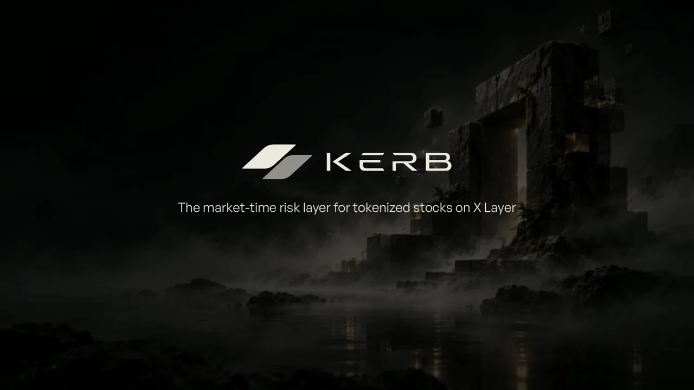
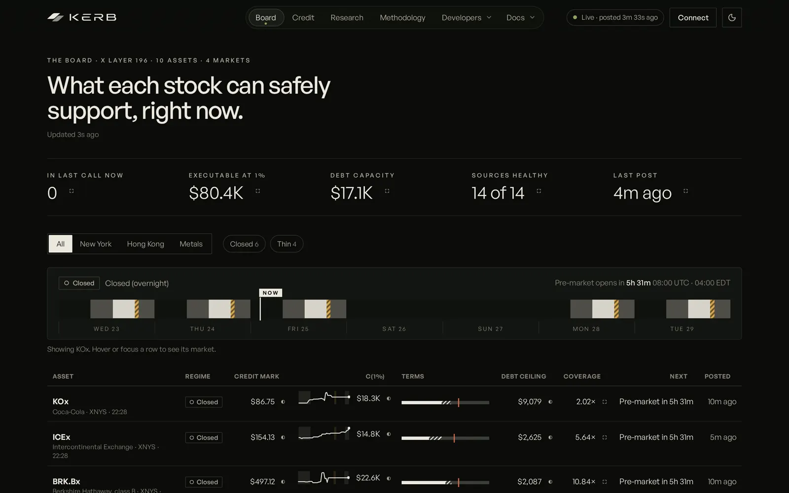
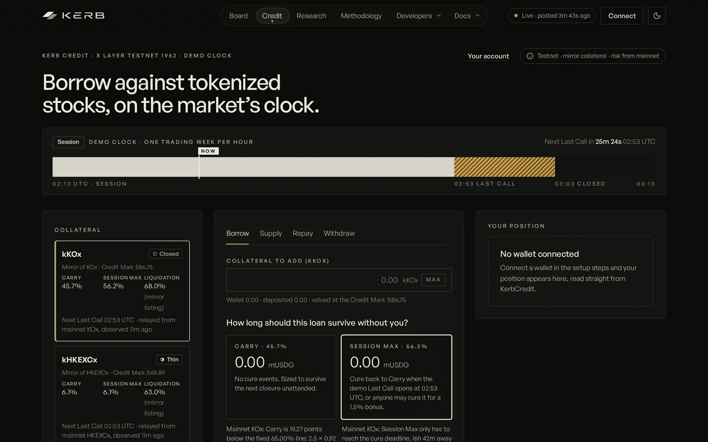
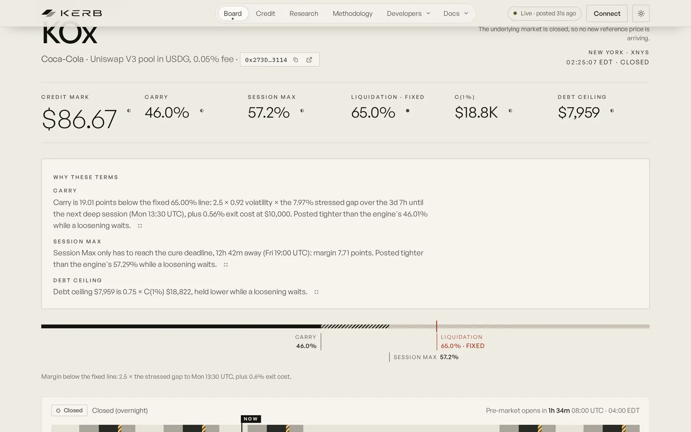
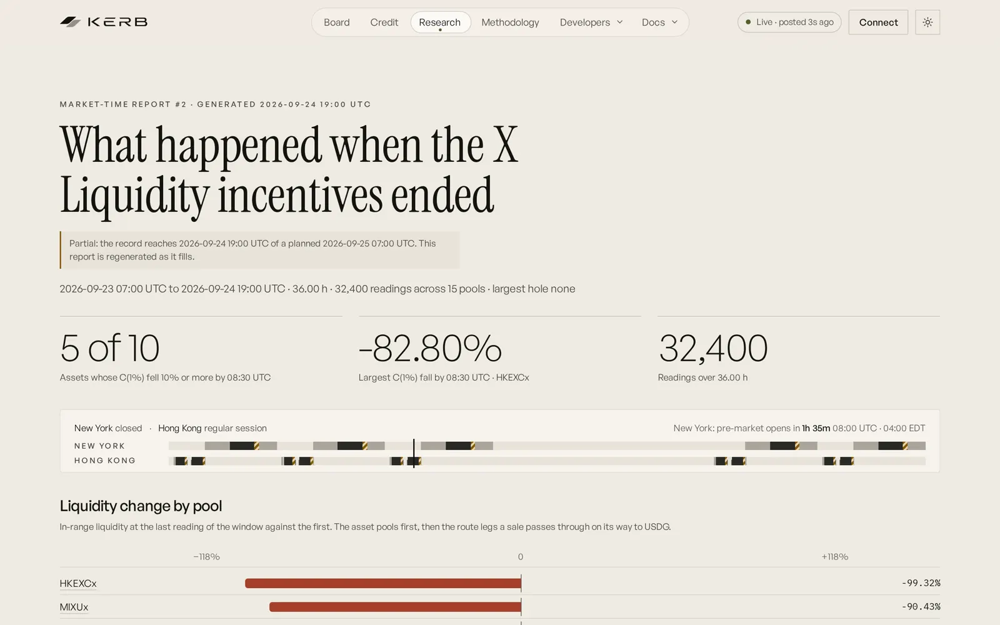
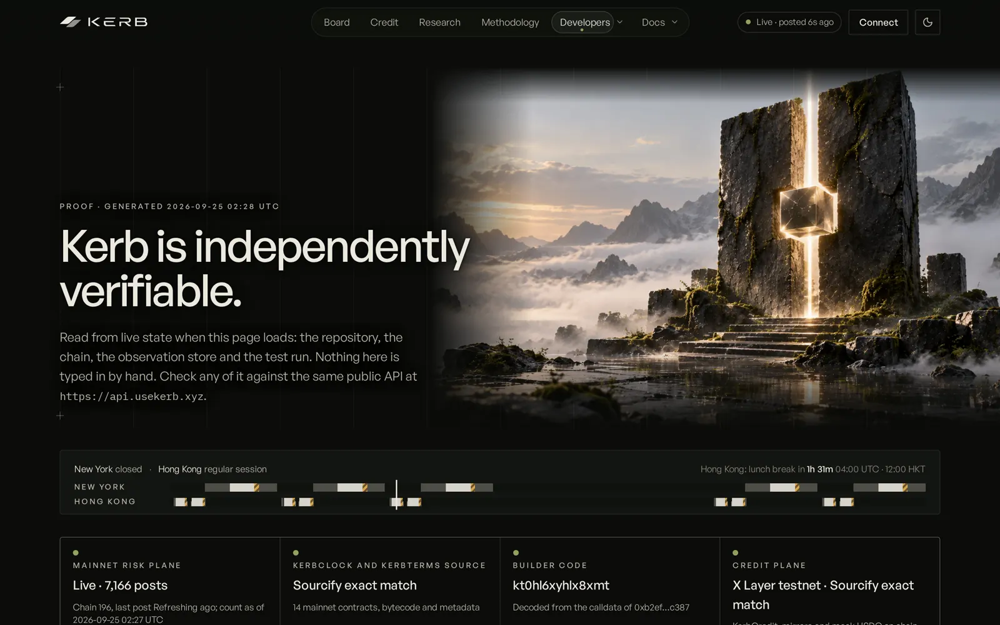
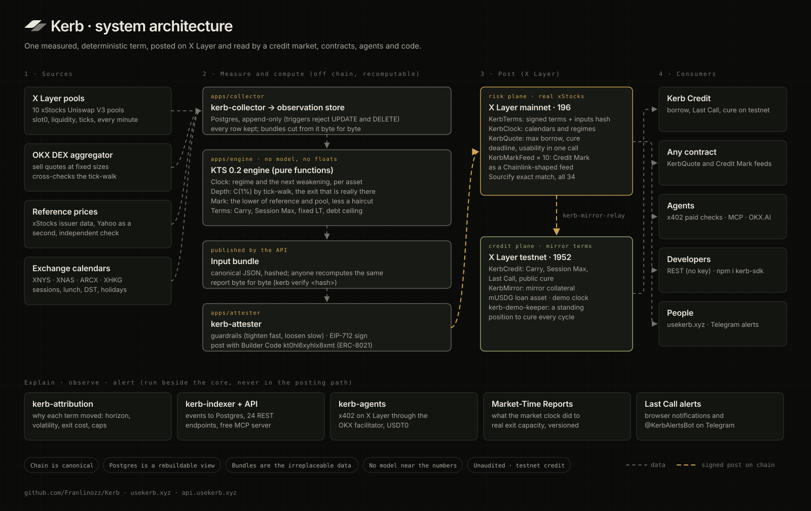

<p align="center"><a href="https://www.usekerb.xyz"><picture><source media="(prefers-color-scheme: dark)" srcset="docs/media/kerb-banner-dark.webp"></picture></a></p>

<h1 align="center">Kerb</h1>

<p align="center"><b>Credit on the market's clock.</b><br>The market-time risk layer for tokenized stocks on X Layer.</p>

<p align="center">
<a href="https://github.com/Franlinozz/Kerb/actions/workflows/ci.yml"></a>
<a href="https://www.oklink.com/xlayer/address/0x6d6eaf24c498df6cef0954f6d19ab4ea7b0102d5"></a>
<a href="https://repo.sourcify.dev/contracts/full_match/196/0x6d6eaf24c498df6cef0954f6d19ab4ea7b0102d5/"></a>
<a href="https://www.npmjs.com/package/kerb-sdk"></a>
<a href="LICENSE"></a>
</p>

<p align="center">
<a href="https://www.usekerb.xyz"><b>Live app</b></a> ·
<a href="https://www.usekerb.xyz/film"><b>The film</b></a> ·
<a href="https://www.usekerb.xyz/docs">Docs</a> ·
<a href="https://www.usekerb.xyz/whitepaper">Whitepaper</a> ·
<a href="https://www.usekerb.xyz/methodology">KTS 0.2</a> ·
<a href="https://www.usekerb.xyz/proof">Proof</a> ·
<a href="https://api.usekerb.xyz/health">API</a> ·
<a href="https://www.usekerb.xyz/faq">FAQ</a> ·
<a href="https://www.usekerb.xyz/llms.txt">llms.txt</a> ·
<a href="https://x.com/usekerb">@usekerb on X</a>
</p>

<p align="center"><a href="https://www.usekerb.xyz/film"></a><br><sub><a href="https://www.usekerb.xyz/film">Watch the film</a> (3:26, chapters and captions) · <a href="https://github.com/Franlinozz/Kerb/releases/latest">1080p master</a></sub></p>

<p align="center"><sub>OKX Dev Day 2026 · Build a Market · Remote · Xyndicate Labs · <a href="https://x.com/usekerb">@usekerb</a></sub></p>

---

Tokenized stocks trade around the clock on X Layer. The markets behind them do not: New York closes, Hong Kong breaks for lunch, weekends last 65 hours. A lender that sizes a loan against a 24/7 price will one day try to liquidate into a pool that is not there.

**Kerb measures the exit that is really there** (executable depth at 1% price impact, by walking the real Uniswap V3 pools tick by tick and cross-checking the OKX DEX aggregator) **and how long a loan must survive before the next deep market** (from each asset's own exchange calendar), and posts both as signed credit terms on X Layer mainnet every few minutes. Every term carries the hash of its inputs and recomputes byte for byte from them. Kerb Credit lends against those terms. So can any contract, agent or app.

## Contents

[At a glance](#at-a-glance) · [Five minutes for judges](#five-minutes-for-judges) · [Screens](#screens) · [How a term is made](#how-a-term-is-made) · [Why it is built this way](#why-it-is-built-this-way) · [Architecture](#architecture) · [One term, four consumers](#one-term-four-consumers) · [Try it](#try-it) · [Verify any number](#verify-any-number) · [What the live system has shown](#what-the-live-system-has-shown) · [Built on OKX and X Layer](#built-on-okx-and-x-layer) · [Engineering](#engineering) · [Deployments](#deployments) · [Documentation](#documentation) · [FAQ](#faq) · [Limitations](#limitations) · [Repository](#repository)

## At a glance

Measured on the live system, 25 Sep 2026 about 02:30 UTC. Each row links to where it can be checked.

| | |
|---|---|
| Assets and markets | 10 xStocks on X Layer (KOx, BRK.Bx, HKEXCx, COINx, KUAIx, ICEx, MIXUx, SHEINx, BMNRx, SLVx) across NYSE, Nasdaq, NYSE Arca and HKEX · [Board](https://www.usekerb.xyz/board) |
| Terms posted on X Layer mainnet | 7,172 signed posts to KerbTerms, each with its inputs hash and Builder Code `kt0hl6xyhlx8xmt` · [/v1/stats](https://api.usekerb.xyz/v1/stats), [KerbTerms on OKLink](https://www.oklink.com/xlayer/address/0x6d6eaf24c498df6cef0954f6d19ab4ea7b0102d5) |
| Observations recorded | 457,224 rows in an append-only store (123,015 pool-state readings, one per pool per minute); UPDATE and DELETE are rejected by database triggers · [Proof](https://www.usekerb.xyz/proof) |
| Contracts | 34 deployments across mainnet and testnet, every one a Sourcify exact match · [Proof](https://www.usekerb.xyz/proof#contracts) |
| Consumers of the same term | Kerb Credit (testnet), KerbQuote and ten Credit Mark feeds (mainnet), paid agent checks over x402 (mainnet), REST, SDK and MCP · [Developers](https://www.usekerb.xyz/developers) |
| Agents | x402 on X Layer mainnet, first settlement [`0xb0be…e982e`](https://www.oklink.com/xlayer/tx/0xb0befc3e64d4ba3e62bd2ab0b5be95ca720a1b2b787df0c6f6cf075a314e982e); registered on OKX.AI as agent #13887, listing under review |
| Tests | 594 TypeScript and 120 Solidity tests, 0 failing ([data/test-report.json](data/test-report.json)); 79 Playwright end-to-end tests including axe accessibility checks on every route in both themes |
| Model in the numbers | None. Pure functions over decimal strings; no LLM or learned model anywhere in measurement, pricing or posting |

## Five minutes for judges

1. **[Board](https://www.usekerb.xyz/board):** every stock's regime, Credit Mark, C(1%) and terms, right now. Hover a Terms cell to read why it is what it is.
2. **[An asset, HKEXCx](https://www.usekerb.xyz/asset/HKEXCx):** "Why these terms" in three computed sentences; the Liquidity tab shows the exit check, Kerb's tick-walk against the OKX DEX quote, with 72 hours of history.
3. **[Credit](https://www.usekerb.xyz/credit):** borrow at Carry or Session Max on a demo clock that runs a trading week every hour. When Last Call opens, a standing demo position appears in *Curable now*: cure it from any wallet for a bonus.
4. **[Proof](https://www.usekerb.xyz/proof):** every contract, the Builder Code decoded from a real transaction, paid agent calls, and the latest term recomputed live from its input bundle.
5. **[Developers](https://www.usekerb.xyz/developers):** `npm i kerb-sdk`, REST with no key, KerbQuote from any contract, and the paid credit check for agents.

The site has a sixty-second guided tour (first visit, or *Docs → Take the tour*). **Automated evaluators:** [`/llms.txt`](https://www.usekerb.xyz/llms.txt) maps every page, contract, endpoint and document; [docs/release/CLAIM_EVIDENCE.md](docs/release/CLAIM_EVIDENCE.md) pairs every public claim with its evidence.

## Screens

<table>
<tr>
<td width="50%"><a href="https://www.usekerb.xyz"></a><br><sub><b>Home.</b> Credit on the market's clock, with both market clocks live.</sub></td>
<td width="50%"><a href="https://www.usekerb.xyz/board"></a><br><sub><b>Board.</b> Every stock's regime, Credit Mark, C(1%) and terms, right now.</sub></td>
</tr>
<tr>
<td><a href="https://www.usekerb.xyz/credit"></a><br><sub><b>Kerb Credit.</b> Carry or Session Max on a demo clock; the brass band is Last Call.</sub></td>
<td><a href="https://www.usekerb.xyz/asset/KOx"></a><br><sub><b>Why these terms.</b> Each number explained with its own inputs.</sub></td>
</tr>
<tr>
<td><a href="https://www.usekerb.xyz/research/2"></a><br><sub><b>Research.</b> What the end of the X Liquidity incentives did to exit capacity.</sub></td>
<td><a href="https://www.usekerb.xyz/proof"></a><br><sub><b>Proof.</b> Every contract, and the latest term recomputed live.</sub></td>
</tr>
</table>

## How a term is made

| Layer | What it answers | How |
|---|---|---|
| **Clock** | What state is this asset's market in, and when does it next weaken? | Each asset follows its underlying market's calendar (sessions, the HKEX lunch break, DST, holidays). A regime machine names the state in strict order: Halted, Stale, Corporate action, Reference closed, Pre-transition, Recovery, Thin, Normal, Deep. The same rules run on chain in `KerbClock`, and a 1,000-timestamp fuzz test holds the two in agreement. |
| **Depth** | How much can be sold before the price moves 1%? | An exact Uniswap V3 tick-walk over the real pools, along the whole path to USDG, cross-checked against OKX DEX aggregator quotes at fixed sizes. When they disagree by more than 25%, the smaller figure is used. |
| **Mark** | What is the collateral worth for credit? | The Credit Mark: the lower of the reference median and the pool price, less a haircut set by the regime. If sources disagree beyond 2%, the regime becomes Stale and new borrowing stops. |
| **Terms** | How much, and for how long? | KTS 0.2, below. Carry, Session Max, a fixed liquidation threshold, and a debt ceiling of 0.75 × C(1%). |
| **Credit** | What happens at the close? | Kerb Credit lends against the posted terms. At Last Call, before the market weakens, a Session Max position must be back at its Carry target; after the owner's window anyone may cure it for a bonus, repaying only the difference. |

**KTS 0.2, horizon-bound margins** ([spec](docs/v2/KTS-0.2.md), [methodology](https://www.usekerb.xyz/methodology)):

```
carryMargin   = max(floor, k · v · g(H_weak) + s)     H_weak: time to the next deep market
sessionMargin = max(floor, k · v · g(H_cure) + s)     H_cure: time to the next cure deadline
carryLTV      = LT − carryMargin                      LT is fixed per asset and never moves
sessionMaxLTV = LT − sessionMargin
```

In one sentence: *a Carry position can take k times the stressed price gap between now and the next deep market, plus the cost of exiting, without crossing the fixed liquidation line.* Before a long closure Carry tightens; Session Max, which only has to reach the next Last Call, does not.

## Why it is built this way

- **Deterministic and recomputable.** The engine is pure functions over decimal strings. Every post carries the keccak256 of its complete input bundle, and `kerb verify <inputsHash>` recomputes it byte for byte. `/proof` does it live.
- **No model near the numbers.** No LLM or learned model sits in measurement, pricing, posting or the paid agent answers. A risk number that cannot be recomputed cannot be trusted.
- **The clock moves the limits, never the liquidation line.** The liquidation threshold is fixed per asset and has no setter; market time moves how much may be borrowed.
- **Tighten fast, loosen slow.** Terms may tighten in one step; loosening is capped per step. The attester may clamp tighter than the engine, never looser, and onchain guardrails bound every value.
- **Every term explains itself.** A deterministic attribution splits every move exactly into horizon, volatility and exit cost, plus caps and clamps, and the site shows it as sentences with their numbers ([spec](docs/v3/SPEC-TERM-ATTRIBUTION.md)).
- **Measured, then published.** Market-Time Reports come from the observation store and are versioned; the dataset is downloadable.
- **Honest labels.** Every live value carries its provenance (Observed, Verified, Computed) and age. Testnet is labelled testnet. Claims are checked by a CI denylist (`scripts/claims-check.sh`).

## Architecture



Drawn by [`scripts/architecture-svg.py`](scripts/architecture-svg.py); the site shows it on the Docs page, in the reader's theme. Detail in [docs/ARCHITECTURE.md](docs/ARCHITECTURE.md).

- **The chain is canonical.** Postgres is a rebuildable view. The append-only observation store and the published input bundles are the only irreplaceable data, and they are never deleted.
- **Two planes.** The risk plane (measurement, terms, KerbQuote, Credit Mark feeds) runs on X Layer mainnet against the real xStocks pools. The credit plane runs on X Layer testnet with mirror collateral, and its terms are relayed from mainnet.
- **Twelve processes** under PM2 on one host: collector, two attesters, mirror relay, indexer, API, attribution, agents, demo keeper, web, web warmer, and staging. Caddy in front.

## One term, four consumers

**Kerb Credit.** The reference market on X Layer testnet: deposit mirror collateral, borrow mUSDG at Carry or Session Max, cure at Last Call. A keeper opens a standing Session Max position every demo cycle so there is always something to cure.

**Any contract, on mainnet.** One view call answers what a position may borrow, until when, and whether the terms are usable:

```solidity
KerbQuote q = KerbQuote(0x223d5e2a97d751403300b55aa92c88a42920e52a); // X Layer mainnet
KerbQuote.Quote memory r = q.quoteToken(xStockToken, amount, KerbQuote.Mode.SessionMax);
// r.usable, r.maxBorrow (USDG units, rounded down), r.cureDeadline, r.ltv, r.liquidationThreshold,
// r.creditMark, r.debtCeiling, r.executableDepth1, r.regime, r.observedAt
```

Ten `KerbMarkFeed` contracts expose each Credit Mark behind a Chainlink-shaped `latestRoundData` (8 decimals) that reverts whenever the terms are not usable.

**Agents.** Paid checks over x402 on X Layer mainnet, one cent in USDT0 through the OKX facilitator, and a free MCP server:

```bash
curl -X POST https://api.usekerb.xyz/agents/credit-check -H 'content-type: application/json' \
  -d '{"asset":"KOx","amount":"25","unit":"token","mode":"carry"}'
# HTTP 402 with PAYMENT-REQUIRED; any x402 client signs and retries, for example @okxweb3/x402-fetch
```

MCP (stateless streamable HTTP): `https://api.usekerb.xyz/mcp`. On OKX.AI: agent #13887, services *Kerb Credit Check* and *Kerb Exit Check*.

**Developers.** REST with no key, and the SDK:

```ts
// npm i kerb-sdk
import { Kerb, toDecimalString } from "kerb-sdk";
const t = await new Kerb().terms("BRK.Bx");            // X Layer mainnet, https://api.usekerb.xyz
if (!t.usable) throw new Error("no new exposure: terms stale or regime unsound");
const carry = toDecimalString(t.carryLTV);             // decimal strings all the way
```

Every endpoint is documented with a captured real response in [docs/API.md](docs/API.md). People can follow a position on Telegram with [@KerbAlertsBot](https://t.me/KerbAlertsBot) (`/watch 0xaddress`).

## Try it

1. Open [www.usekerb.xyz/credit](https://www.usekerb.xyz/credit) and connect a browser wallet (OKX Wallet or any EIP-6963 wallet). The page adds X Layer testnet (1952).
2. Get test OKB for gas from the [X Layer faucet](https://www.okx.com/xlayer/faucet).
3. Mint test collateral (kKOx) and mUSDG with the buttons in *Get set up*.
4. Deposit, choose **Session Max**, borrow. When the demo Last Call opens, your position appears in **Curable now**: repay the difference, or cure it from a second wallet for the bonus.
5. Open [Your account](https://www.usekerb.xyz/account) for holdings, positions and history. It also prices any real xStocks an address holds on mainnet through KerbQuote.

## Verify any number

No account, no key and no Kerb database: a clone of this repository, the public API for the bundle bytes, and the X Layer RPC for what was posted.

```bash
git clone https://github.com/Franlinozz/Kerb && cd Kerb && pnpm install
pnpm --filter @kerb/engine kerb verify <inputsHash>                 # against KerbTerms.latest on chain
pnpm --filter @kerb/engine kerb verify <inputsHash> --tx <txHash>   # against the TermsPosted log of any post
```

It fetches the bundle, rejects any bytes that do not hash to `inputsHash`, recomputes every figure under the formula version the bundle names, and compares with the values KerbTerms holds on X Layer. A real run on 25 Sep, 02:50 UTC, for a live KOx post:

```
posted     chain 196 KOx read from KerbTerms.latest(0x2052b48f…) at 0x6d6eaf24c498df6cef0954f6d19ab4ea7b0102d5 (no database used)
  creditMark         MATCHES                  posted 86750299641130959576  recomputed 86750299641130959576
  carryLTV           MATCHES                  posted 457586285202016380  recomputed 457586285202016380
  sessionMaxLTV      MATCHES                  posted 563106364426488597  recomputed 563106364426488597
  debtCeiling        clamped tighter onchain  posted 9260168422  recomputed 13744814941
  executableDepth1   MATCHES                  posted 18326419921  recomputed 18326419921
recompute  the inputs reproduce the posted terms
```

"Clamped tighter onchain" is the guardrail at work: a posted value may be tighter than the engine's, never looser. The same check runs live on [/proof](https://www.usekerb.xyz/proof). Evidence files: [data/release/crucible-2026-09-25](data/release/crucible-2026-09-25).

## What the live system has shown

- **Weekend closure** ([Report #1](https://www.usekerb.xyz/research/1)). Over 42 hours and 35,130 readings of a closed weekend, in-range liquidity fell on 7 of 10 asset pools, the largest by 49%. A capacity number fixed at Friday's close would have been wrong all weekend.
- **Incentives ending** ([Report #2](https://www.usekerb.xyz/research/2), final: 23 Sep 07:00 to 25 Sep 07:00 UTC, 43,185 readings across 15 pools). At the 07:00 UTC end of the X Liquidity campaign on 24 Sep, C(1%) held for all ten assets. By the 08:30 UTC capture it had fallen by 10% or more for five of ten, the largest HKEXCx at −82.80%; by the 25 Sep 07:00 UTC capture, for six of ten, the largest KUAIx at −99.44%, while four rose by 10% or more. The Hong Kong close at 08:00 UTC sits inside the first interval, and the report says so.
- **The dispersion guard, in production.** From 24 Sep 08:13 to 25 Sep 01:43 UTC, HKEXCx's pool price sat more than 2% from its reference (2.29% at entry). The regime went to Stale and new borrowing stopped on its own; when the sources agreed again it moved to Recovery and loosened in capped steps. Every transition is on [the asset page](https://www.usekerb.xyz/asset/HKEXCx) with its rule.
- **Tighten fast, loosen slow.** On 23 Sep a real pool event cut BRK.Bx liquidity by 43%; its debt ceiling tightened in the next post and may loosen only in capped steps.

## Built on OKX and X Layer

| Integration | Where |
|---|---|
| X Layer mainnet (196) | KerbTerms, KerbClock, KerbQuote, ten KerbMarkFeed; real xStocks pools read every minute |
| X Layer testnet (1952) | Kerb Credit, mirror collateral, demo clock, keeper |
| OKX DEX aggregator API | Independent sell quotes that bound the measured exit capacity |
| OKX x402 facilitator | Paid agent checks settled in USDT0 on X Layer mainnet (`@okxweb3/x402-express`) |
| OKX.AI (Onchain OS) | Agent #13887 with two A2MCP services; listing under review |
| OKX Builder Code | `kt0hl6xyhlx8xmt` on every transaction as an ERC-8021 suffix, decoded on /proof |
| OKX Wallet | First in the wallet picker (EIP-6963 discovery) |

## Engineering

- **Tests.** 594 TypeScript and 120 Solidity tests, 0 failing, measured 25 Sep ([data/test-report.json](data/test-report.json), shown on /proof). 79 Playwright tests run in a real browser against a production build, including axe checks on every route in both themes, a guided-tour walk, the menus, and a mocked session transition. Among the unit tests: the 1,000-timestamp clock fuzz, byte-identical recomputation of historical bundles, the exact additive split of attribution, and Kerb Credit invariants under a guided handler.
- **Real browsers, real chain.** The full credit lifecycle (deposit, borrow, Last Call, cure, repay, withdraw) was run in Chromium on production against testnet ([data/credit-flow-2026-09-23.json](data/credit-flow-2026-09-23.json)).
- **Hardening.** Append-only tables enforced by triggers; secret scan clean; a 340-button dead-control sweep; Lighthouse 85+ measured on every route on 24 Sep; blue-green web deploys with rollback ([scripts/deploy-web.sh](scripts/deploy-web.sh)). See [SECURITY.md](SECURITY.md).
- **CI on every push.** Typecheck, lint, unit tests, Foundry tests, em-dash copy check, claims denylist, and the E2E suite.

```bash
pnpm install && pnpm typecheck && pnpm test && pnpm lint
cd contracts && forge test
pnpm --filter @kerb/web e2e          # against a running app (KERB_WEB_URL)
```

## Deployments

X Layer mainnet (196), the risk plane:

| Contract | Address | Source |
|---|---|---|
| KerbTerms | [0x6d6eaf24c498df6cef0954f6d19ab4ea7b0102d5](https://www.oklink.com/xlayer/address/0x6d6eaf24c498df6cef0954f6d19ab4ea7b0102d5) | [Sourcify exact match](https://repo.sourcify.dev/contracts/full_match/196/0x6d6eaf24c498df6cef0954f6d19ab4ea7b0102d5/) |
| KerbClock | [0xf765d374e0ce576860a463f0d796ad45c62161b8](https://www.oklink.com/xlayer/address/0xf765d374e0ce576860a463f0d796ad45c62161b8) | [Sourcify exact match](https://repo.sourcify.dev/contracts/full_match/196/0xf765d374e0ce576860a463f0d796ad45c62161b8/) |
| KerbQuote | [0x223d5e2a97d751403300b55aa92c88a42920e52a](https://www.oklink.com/xlayer/address/0x223d5e2a97d751403300b55aa92c88a42920e52a) | [Sourcify exact match](https://repo.sourcify.dev/contracts/full_match/196/0x223d5e2a97d751403300b55aa92c88a42920e52a/) |
| KerbMarkFeedFactory | [0x6aababf6d83fcfb81459f8ffee3f6dd9b83d7f6f](https://www.oklink.com/xlayer/address/0x6aababf6d83fcfb81459f8ffee3f6dd9b83d7f6f) | [Sourcify exact match](https://repo.sourcify.dev/contracts/full_match/196/0x6aababf6d83fcfb81459f8ffee3f6dd9b83d7f6f/) |
| KerbMarkFeed × 10 | listed on [Developers](https://www.usekerb.xyz/developers#solidity) and [Proof](https://www.usekerb.xyz/proof#contracts) | Sourcify exact match |

X Layer testnet (1952), the credit plane:

| Contract | Address |
|---|---|
| KerbCredit | [0xa1314645cd6c07e651359aba540e2600090b98a8](https://www.oklink.com/x-layer-testnet/address/0xa1314645cd6c07e651359aba540e2600090b98a8) |
| KerbTerms (mirror) | [0x5a4942f55e37994370745ef984a21321edb75f7e](https://www.oklink.com/x-layer-testnet/address/0x5a4942f55e37994370745ef984a21321edb75f7e) |
| KerbClock / KerbClockDemo | [0x6c1de992…bc5c](https://www.oklink.com/x-layer-testnet/address/0x6c1de992e3219980138d7e51b67ecc523618bc5c) / [0xd2483b2d…b0f](https://www.oklink.com/x-layer-testnet/address/0xd2483b2d8bd759f87fadb21117498a5db36bcb0f) |
| KerbMirror kKOx / kHKEXCx | [0x11827f0f…4a16](https://www.oklink.com/x-layer-testnet/address/0x11827f0f59d516e3778951fde36bd0d961af4a16) / [0x80da4036…60f2](https://www.oklink.com/x-layer-testnet/address/0x80da4036ee45e6d66a27dba415a4ce23eb9360f2) |
| MockUSDG (mUSDG) | [0x91fcf992…a679](https://www.oklink.com/x-layer-testnet/address/0x91fcf99262214c32f6fe342d94c7b0dfb2dba679) |
| KerbQuote / KerbMarkFeedFactory | [0xfd688bc3…1c05](https://www.oklink.com/x-layer-testnet/address/0xfd688bc3a93d04976bfced0b2ea7f90c11561c05) / [0xc363050c…be6b](https://www.oklink.com/x-layer-testnet/address/0xc363050c142ff447910cf6f31480605f7dbdbe6b) |

All 34 deployments, with verification links, are on [/proof](https://www.usekerb.xyz/proof#contracts) and in [config/deployments.json](config/deployments.json). Mainnet debt capacity is denominated in USDG (`0x4ae46a509F6b1D9056937BA4500cb143933D2dc8`).

## Documentation

| On the site | In the repository |
|---|---|
| [Docs](https://www.usekerb.xyz/docs): every surface, start to finish | [ARCHITECTURE.md](docs/ARCHITECTURE.md): system design, contracts, data flow |
| [Whitepaper](https://www.usekerb.xyz/whitepaper) ([PDF](https://www.usekerb.xyz/kerb-whitepaper.pdf)) | [KTS-0.1](docs/KTS-0.1.md) and [KTS-0.2](docs/v2/KTS-0.2.md): the standard |
| [Methodology](https://www.usekerb.xyz/methodology): KTS 0.2 with live values | [API.md](docs/API.md): every endpoint with a real response |
| [FAQ](https://www.usekerb.xyz/faq) | [CLAIM_EVIDENCE.md](docs/release/CLAIM_EVIDENCE.md): every claim and its evidence |
| [Changelog](https://www.usekerb.xyz/changelog) | [SECURITY.md](SECURITY.md): threat model and trust assumptions |
| [Terms](https://www.usekerb.xyz/legal/terms) · [Privacy](https://www.usekerb.xyz/legal/privacy) · [Risk disclosure](https://www.usekerb.xyz/legal/risk) | [Term attribution spec](docs/v3/SPEC-TERM-ATTRIBUTION.md) · [brand assets](docs/brand-assets) |
| [llms.txt](https://www.usekerb.xyz/llms.txt): a map for language models | [THIRD_PARTY.md](docs/THIRD_PARTY.md): licences |

## FAQ

**Isn't this what Aave or Morpho do?** Tokenized-stock lending exists: Kamino runs an xStocks market on Solana, Morpho lists Ondo and Coinbase stock tokens on Ethereum and Base, and Aave has announced equity lending for V4. Those markets price collateral with oracles and set risk parameters per market; a Morpho market fixes its liquidation LTV when it is created. Kerb is the layer such a market would read: a measured, recomputable answer to how much of a position the onchain pool could absorb and how long a loan must survive before the next deep market, published on X Layer. Chainlink's 24/5 equity streams tell you what a stock is worth and whether its market is open; Kerb tells you whether the exit is there. They complement each other, and Chainlink is Kerb's planned rung-1 reference once credentials are in place.

<sub>Sources: [Morpho on Ondo tokenized stocks](https://morpho.org/stories/ondo); The Block on Kamino's xStocks market (July 2025); Aave's V4 tokenized-stock announcement (26 June 2026); Chainlink's blog on 24/5 US Equities Streams (20 January 2026).</sub>

**Why not just use an oracle price?** A price says what a share is worth, not whether the pool can absorb the sale that a liquidation needs. Report #2 measured executable depth at 1% for HKEXCx falling by 82.80% within ninety minutes of the X Liquidity incentives ending. A price feed does not show that.

**Is there a model anywhere in Kerb?** No. Every number is a pure function of observed data, and every term recomputes from its published input bundle. The agent endpoints sell that computed answer; they do not generate one.

**Why is credit on testnet?** The contracts are unaudited, the operator does not hold the production tokenized assets, and lending real money would need both. The risk plane that Kerb Credit reads is on mainnet against the real pools. More in the [FAQ](https://www.usekerb.xyz/faq).

## Limitations

- The credit plane runs on X Layer testnet with mirror collateral and mUSDG. Its terms are relayed from mainnet. Mirror listings carry a liquidation threshold three points above mainnet so the covenant can trigger inside the compressed demo cycle; the reason is stated on `/v1/credit/1952`.
- The contracts are **unaudited**. The mainnet deployment is the risk plane only and holds no user funds.
- One attester signs the terms. The guardrails bound what it can post, and it may only clamp tighter than the engine.
- Reference prices come from issuer data with an independent public check; Chainlink Data Streams would be the stronger rung and needs credentials. Input bundles are served by the Kerb API since IPFS pinning reached its plan limit on 21 Sep; every bundle remains verifiable by hash. Each rung is stated live on [/proof](https://www.usekerb.xyz/proof) and in [SECURITY.md](SECURITY.md).

## Repository

| Path | What |
|---|---|
| `apps/collector` | Append-only observation loops: pool state, prices, quotes, multipliers |
| `apps/engine` | KTS as pure functions, attribution, `kerb report`, `kerb verify`, Market-Time Reports |
| `apps/attester` | Signs, stores and posts terms; the mirror relay; deployment scripts |
| `apps/api` | Public read API ([docs/API.md](docs/API.md)) |
| `apps/agents` | x402 paid checks, the MCP server, Telegram Last Call alerts |
| `apps/indexer` | Chain events into Postgres, reorg-aware |
| `apps/web` | The site (Next.js); `e2e/` is the Playwright suite |
| `packages/v3math`, `packages/calendar` | Exact tick-walk simulation; per-market calendars and the Clock |
| `packages/sdk` | `kerb-sdk` on npm |
| `contracts` | KerbClock, KerbTerms, KerbCredit, KerbMirror, KerbClockDemo, KerbQuote, KerbMarkFeed |
| `data` | Reports, datasets, test report, recorded browser runs and screenshots |

## Attribution and licences

Kerb is MIT licensed ([LICENSE](LICENSE)). Built by Xyndicate Labs ([@xyndicatepro](https://x.com/xyndicatepro)). Built with viem, wagmi, Next.js, React, TanStack Query, Fastify, postgres.js, drizzle-orm, decimal.js, Playwright, Vitest, TypeScript, OpenZeppelin Contracts and Foundry (MIT, Apache-2.0 or Unlicense; details in [docs/THIRD_PARTY.md](docs/THIRD_PARTY.md)). General Sans is from the Indian Type Foundry under its Free Font Licence and is fetched at build time, not redistributed here; Instrument Serif and IBM Plex Mono are under the SIL Open Font License. Data: xStocks public API, X Layer RPC, Uniswap V3 on X Layer, the OKX DEX aggregator, and the Yahoo Finance chart endpoint as an independent reference (see `data/SOURCES.md`). Brand and art by the operator.
